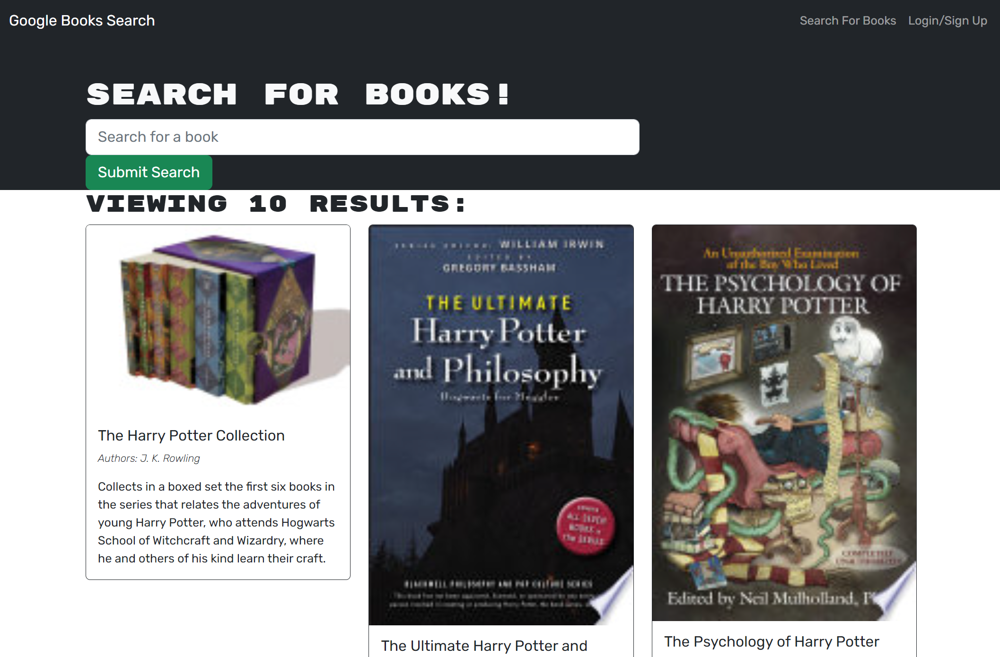

# Books-MERN-Stack

  

## Description

This application was to take source code from being a RESTful application and convert that to a MERN stack application by implementing GraphQL. This taught me a good amount of information about different npm packages that could be implemented and challenges you may face with deprecations. Overall, I learned a great deal in documentation dives to find syntactical differences between technologies.

***Please Note*** Having difficulties with login functionality. Working on a fix.

## Table of contents
- [Installation](#Insallation)
- [Deployment](#Deployment)
- [Usage](#Usage)
- [Contribution](#Contributing)
- [Test](#Test)
- [Questions](#Questions)

## Installation

CD into the root folder after cloning this repository and npm i.

Please reference the package.json files that are on the root level, server level as well as client level.

## Deployment

This is currently deployed on Heroku - https://mighty-mesa-95864.herokuapp.com/

## Usage

There is a fully functioning API that will allow the user to search for virtually any book title. Simply type a book title into the search field and browse!

## Collaborators

 - Source code provided from [Xandromus](https://github.com/coding-boot-camp/solid-broccoli)

 - [Josh Minor](https://github.com/jminor90)

## Test

npm run test

## Questions

Have questions? Please feel free to reach out to me at:

GitHub Username: [Christoph551](https://github.com/Christoph551)

Email: [Email](mailto:christophersimmonds551@gmail.com)